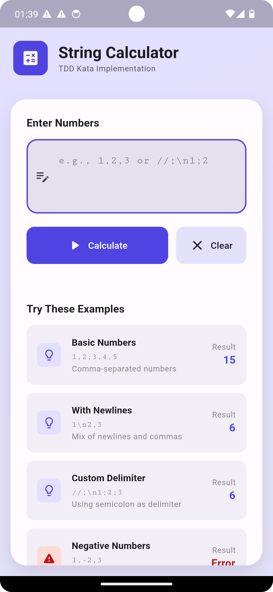

# 🧮 String Calculator - TDD Kata

> A Flutter implementation of the String Calculator TDD Kata for Incubyte Assessment

---

## 🚀 Quick Access

### 📱 Try the App
- **Android APK:** [Download APK](https://drive.google.com/file/d/1nwMgCEj4DvVccl9NEIn2yGpxLaLjwP94/view?usp=sharing)

### 🎥 Watch Demo
- **Feature Demo:** [YouTube Video](https://youtube.com/shorts/512GqTS9Yjw?feature=share)

---

## 📸 Preview



---

## ✨ What It Does

This String Calculator can:
- ✅ Add comma-separated numbers: `1,2,3` → `6`
- ✅ Handle newlines: `1\n2,3` → `6`
- ✅ Custom delimiters: `//;\n1;2` → `3`
- ✅ Detect negative numbers and show errors
- ✅ Beautiful UI with dark mode

---

## 🧪 Built with TDD

- 8 unit tests, all passing ✅
- 100% code coverage 📊
- Every feature test-first 🔴 → 🟢 → 🔄
```bash
flutter test
```

---

## 🚀 Quick Start
```bash
git clone https://github.com/uvaishzafri/string-calculator-tdd.git
cd string-calculator-tdd
flutter pub get
flutter run
```